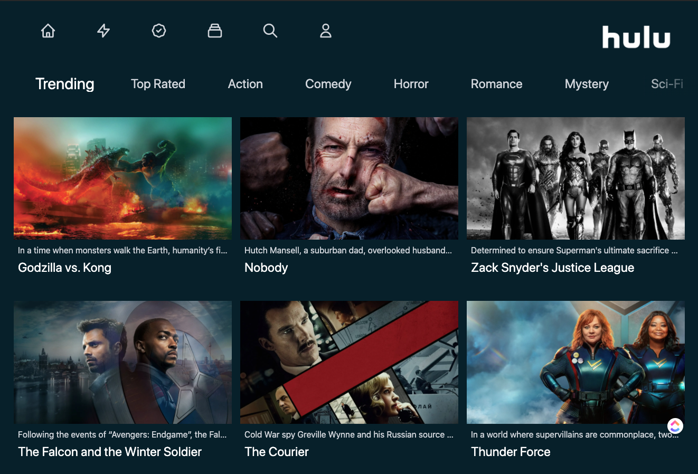

# Hulu - clone

[Hulu-clone](https://hulu-colone.vercel.app/) project that interacts with  
[The Movie Database (TMDb)](https://www.themoviedb.org)

## Built With

- [React](https://reactjs.org/) - A JavaScript library for building user interfaces
- [Next.js](https://nextjs.org/) - The React Framework for Production
- [Tailwindcss](https://tailwindcss.com/) - Rapidly build modern websites without ever leaving your HTML
- [Heroicons](https://heroicons.com/) - Beautiful hand-crafted SVG icons,
  by the makers of Tailwind CSS.

## Deployd on Vercel

- Go to Site [Hulu-clone](https://hulu-colone.vercel.app/)
